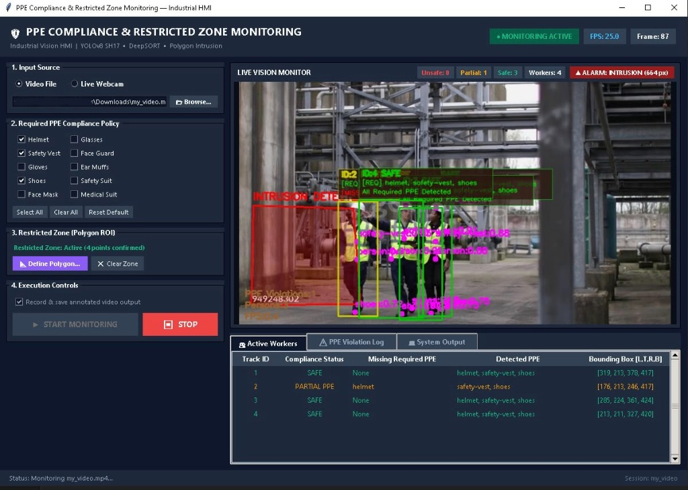

# PPE Compliance & Restricted Zone Monitoring System

A computer-vision safety monitoring system that integrates deep-learning object detection, multi-object tracking, spatial equipment association, temporal compliance smoothing, and polygon-based restricted-zone intrusion monitoring with an interactive Tkinter graphical interface.


*Figure 1: Tkinter HMI Dashboard displaying real-time worker tracking, PPE compliance status cards, worker track table, event logging, and zone intrusion status.*

---

## Overview

In construction, manufacturing, and industrial facilities, ensuring that personnel wear required Personal Protective Equipment (PPE) and stay clear of hazardous machinery or restricted perimeters is essential for workplace safety. Standard surveillance cameras typically record footage passively without automated intervention, while basic object-detection models only identify isolated bounding boxes without attributing equipment to individual workers or tracking compliance over time.

This project implements an end-to-end computer-vision system that solves these challenges. It does not treat PPE detection as a simple isolated object-detection task; instead, it provides a comprehensive pipeline that:
- Detects persons, anatomical regions, and safety equipment in a single inference pass using a 17-class YOLOv8m model.
- Tracks workers persistently across video frames using DeepSORT.
- Associates detected safety gear to individual workers through spatial containment and bounding-box intersection.
- Evaluates compliance dynamically against an operator-configurable checklist of required PPE.
- Stabilizes compliance decisions using a rolling temporal voting filter to suppress transient single-frame detector flicker.
- Monitors an operator-defined polygon restricted area for physical intrusion events.
- Emits structured event-driven CSV audit logs and evidentiary snapshots when state changes occur.
- Runs an automated sidecar process that groups raw intrusion detections into distinct incidents and generates animated GIF evidence.
- Provides a Tkinter desktop Human-Machine Interface (HMI) for camera/video selection, interactive polygon configuration, checklist selection, and real-time visualization.

---

## Key Features

- **Single-Pass 17-Class Detection:** Uses a YOLOv8m model trained on the SH17 ontology to identify workers, anatomy (head, hands, feet, face, ears), and protective equipment (helmets, vests, gloves, shoes, masks, glasses, ear-mufs) simultaneously.
- **Persistent Worker Tracking:** DeepSORT maintains consistent numerical worker identities (`Track ID`) across frame-to-frame movement and short-term occlusions.
- **Spatial PPE-to-Worker Association:** Bounding-box intersection and containment algorithms link detected equipment to specific workers.
- **Operator-Configurable Compliance Checklist:** Operators can select any combination of 10 supported equipment classes as mandatory for a given session.
- **Temporal Compliance Smoothing:** A 5-frame rolling majority voting filter prevents single-frame detection dropouts from triggering false alarms.
- **State-Change Violation Logging:** Generates audit log records and snapshot images only upon initial violation or when a worker's missing PPE set changes, suppressing duplicate frame-by-frame rows.
- **Arbitrary Polygon Restricted Zones:** Operators can interactively define multi-point polygon boundaries of any shape; intrusion is evaluated exclusively within the polygon.
- **Motion-Based Intrusion Detection:** Differential pixel motion analysis detects movement inside the restricted polygon and logs timestamped intrusion events with a cooldown timer.
- **Incident Grouping & GIF Synthesis:** A background watcher service aggregates related intrusion events into consolidated incidents and compiles multi-frame animated GIFs.
- **Tkinter Desktop Operator Interface:** Provides live video playback, video source switching (webcam or file), polygon ROI drawing, status indicators, worker telemetry tables, and diagnostic event consoles.
- **Self-Contained Edge Execution:** Operates entirely locally without cloud, external database, or third-party web service dependencies.

---

## System Architecture

The system operates two independent, decoupled monitoring pipelines sharing the underlying video feed:

### 1. PPE Compliance Monitoring Pipeline
```
Input Source (Webcam / Video File)
        │
        ▼
YOLOv8m SH17 Detection (models/yolo8m.pt)
 ├── Persons (Class 0)
 └── PPE & Anatomy (Classes 1–16)
        │
        ├─────────────────────────────┐
        ▼                             ▼
DeepSORT Tracking             PPE Detections
 (Persistent Track IDs)               │
        │                             │
        └──────────────┬──────────────┘
                       ▼
      PPE-to-Person Spatial Association
       (IoU & Containment Overlap Ratio)
                       ▼
           Temporal Compliance Filter
         (5-Frame Rolling Majority Vote)
                       ▼
           Per-Worker Status Evaluation
            (SAFE / PARTIAL PPE / UNSAFE)
                       ▼
          State-Change Event Machine
                       ▼
        Structured CSV Logs & Snapshots
```

### 2. Restricted-Zone Intrusion Monitoring Pipeline
```
Video Frame (Grayscale)
        │
        ├──────────────────────────────┐
        ▼                              ▼
Reference Frame                 Current Frame
        │                              │
        └──────────────┬───────────────┘
                       ▼
           Absolute Frame Difference
                       ▼
           Binary Thresholding (130)
                       ▼
      Bitwise Masking with Polygon ROI
                       ▼
          Intrusion Pixel Threshold
            (Motion Pixels > 100)
                       ▼
          Raw Intrusion Log & Snapshot
                       ▼
        Sidecar Log Watcher (10s Window)
                       ▼
    Grouped Incident CSV & Animated GIF
```

---

## PPE Compliance Logic

Evaluating compliance accurately requires moving beyond raw object detections to structured person-level state management:

### 1. Detection & Separation
Each frame is passed to the YOLOv8m detector. Detections with confidence $\ge 0.40$ are split into:
- **Candidate Persons:** Bounding boxes labeled `person` (Class 0).
- **Candidate Gear:** Bounding boxes labeled with protective items or anatomical markers.

### 2. Worker Tracking
Candidate person boxes are fed to the DeepSORT tracker (`max_age=70`, `n_init=1`). The tracker outputs confirmed tracks with a persistent integer `track_id` and smoothed bounding box coordinates.

### 3. Spatial Association
To determine which worker is wearing which item, the system computes the containment overlap ratio:
$$\text{Overlap Ratio} = \frac{\text{Area}(\text{Box}_{\text{person}} \cap \text{Box}_{\text{ppe}})}{\text{Area}(\text{Box}_{\text{ppe}})}$$
- If the overlap ratio exceeds the threshold ($0.30$), the item is considered associated with the person.
- When multiple workers overlap the same piece of equipment, a winner-takes-all strategy assigns the equipment to the worker with the highest overlap ratio.

### 4. Compliance Classification
The operator selects which gear items are required (e.g., `helmet`, `safety-vest`, `shoes`). For each worker:
- **`SAFE`:** All required items are present ($\text{Missing} = \emptyset$).
- **`PARTIAL PPE`:** At least one required item is detected, but one or more are missing.
- **`UNSAFE`:** None of the required items are detected.

### 5. Temporal Smoothing (Flicker Suppression)
To avoid false alarms caused by momentary detector occlusion or motion blur:
- The system maintains a rolling buffer of the last 5 raw frame statuses for each tracked worker.
- **Majority Rule:** The worker's assigned status is the mode of the buffer ($\ge 3$ out of 5 frames).
- **Tie-Breaking Rule:** In the event of a tie, the more severe non-compliant status takes precedence:
  $$\text{UNSAFE} > \text{PARTIAL PPE} > \text{SAFE}$$

### 6. Event-Driven Violation Logging
To prevent thousands of redundant log rows during continuous violations:
- A log entry and a snapshot are written only when a worker **first enters** a non-compliant state, or when their **set of missing gear changes**.
- While the worker remains in the same violation state with the identical missing items, frame-by-frame duplicate writes are suppressed.
- If the worker corrects their equipment and returns to `SAFE`, their state resets cleanly.

---

## Restricted-Zone Intrusion Monitoring

Hazardous areas (e.g., heavy equipment swing radius, high-voltage equipment, loading bays) often have irregular, non-rectangular shapes.

1. **Polygon Definition:** Operators define arbitrary 2D polygons ($\ge 3$ vertices) directly on the video feed. Vertices are mapped and clamped to native video dimensions.
2. **Binary Masking:** A binary mask matching the video resolution is generated using `cv2.fillPoly`.
3. **Differential Motion Detection:** The system computes the absolute difference between the current frame and an initial reference frame:
   $$\Delta = |I_t - I_0|$$
4. **Isolated Evaluation:** Motion pixels exceeding pixel intensity 130 are filtered using bitwise AND with the polygon mask:
   $$M_{\text{inside}} = M_{\Delta > 130} \cap M_{\text{poly}}$$
5. **Alarm Trigger & Cooldown:** If $count(M_{\text{inside}}) > 100\text{ pixels}$, an intrusion alarm is triggered. An evidence image is captured, and an entry is appended to `intrusion_log.txt`. A 5-second cooldown timer prevents repeated trigger loops.
6. **Sidecar Watcher & GIF Generation:** A background daemon (`scripts/intrusion_log_watcher.py`) monitors `intrusion_log.txt`. Events occurring within 10 seconds of each other are consolidated into a single continuous incident. The watcher extracts the corresponding snapshot images and compiles an animated GIF demonstrating the intrusion event.

---

## Human-Machine Interface (HMI)

The desktop operator interface (`app.py`) is implemented in Python Tkinter and provides:

- **Input Selection:** Switch between connected camera hardware (with automatic device index probing) and local video files via native file browser.
- **Configurable PPE Checklist:** Toggle individual checkboxes for 10 supported equipment types, with *Select All*, *Clear All*, and *Reset Default* controls.
- **Interactive Polygon Canvas:** Draw multi-point polygon perimeters directly over a paused reference frame, with real-time vertex tracking, coordinate scaling, and reset controls.
- **Live Stream Display:** Displays the annotated video stream with dynamic aspect-ratio scaling.
- **Status Indicators:** Header status badge reflecting operational state (`IDLE`, `RUNNING`, `ALARM`), active worker counts by compliance category, and intrusion warnings.
- **Worker Telemetry Grid:** Real-time tabular view showing active worker IDs, compliance status, detected gear, and missing items.
- **Violation Event Log Viewer:** Scrollable table displaying logged violations with timestamps and links to snapshot files.
- **System Event Console:** Diagnostics console recording operational events, configuration changes, and errors.

---

## Demonstration Evidence

Curated demonstration outputs from representative sessions are located in the `output/demo/` directory:

| Asset | File | Description |
|---|---|---|
| **Annotated Video** | `output/demo/annotated_video.mp4` | Recorded video showing live DeepSORT tracking boxes, PPE compliance cards, and active polygon restricted zone. |
| **Compliance Audit Log** | `output/demo/compliance_log.csv` | Structured CSV log recording worker IDs, timestamps, gear status (Helmet, Vest, Shoes), missing items, and snapshot links. |
| **Worker Violation Snapshot** | `output/demo/violation_snapshot.jpg` | High-resolution image capture of a worker flagged for missing safety equipment with visual compliance card overlay. |
| **Intrusion Event GIF** | `output/demo/intrusion_event.gif` | Multi-frame animated incident capture showing an intrusion event into the restricted polygon. |
| **Intrusion Frame Snapshot** | `output/demo/intrusion_snapshot.jpg` | Full-frame image captured at the moment of restricted-zone perimeter breach. |
| **Intrusion Incident Log** | `output/demo/intrusion_log.csv` | Grouped incident summary reporting incident duration, detection count, and associated evidence GIF. |

---

## Technology Stack

| Component | Technology | Role |
|---|---|---|
| **Language** | Python 3.10–3.12 | Primary implementation language |
| **Computer Vision** | OpenCV (`opencv-python`) | Video decoding/encoding, image drawing, differential motion detection |
| **Deep Learning** | Ultralytics YOLOv8 | Single-pass 17-class object detection |
| **Tracking** | DeepSORT (`deep-sort-realtime`) | Kalman filtering and Hungarian association for worker tracking |
| **Tensors & Math** | PyTorch / NumPy | Tensor inference and numerical matrix operations |
| **Geometry** | Shapely | Polygon validation and coordinate geometry calculations |
| **GUI Framework** | Tkinter / Pillow | Desktop HMI, canvas rendering, and animated GIF compilation |
| **File Monitoring** | Watchdog | File-system event monitoring in the sidecar intrusion watcher |

---

## Project Structure

```
PPE-Detection-YOLOv8-main/
├── .gitignore                      # Git configuration (tracks models, samples, and demo assets)
├── PROJECT_STATUS.md               # Technical architecture and validation status reference
├── README.md                       # Project manual and public documentation
├── requirements.txt                # Full runtime dependencies
├── requirements_edge.txt           # Minimal edge dependencies
├── run_gui.bat                     # Primary Windows launcher (auto-detects venv, starts silent watcher and HMI)
├── run_tests.cmd                   # Unittest suite launcher
├── stop.bat                        # Process termination utility
├── app.py                          # Tkinter Human-Machine Interface application
├── main.py                         # Core detection, tracking, compliance, and intrusion engine
│
├── docs/
│   └── assets/
│       └── hmi_dashboard.png       # HMI screenshot for documentation
│
├── models/
│   └── yolo8m.pt                   # YOLOv8m weights for 17-class SH17 ontology (49.6 MiB)
│
├── output/
│   └── demo/                       # Curated demonstration assets
│       ├── annotated_video.mp4     # Demonstration output video with overlays
│       ├── compliance_log.csv      # Sample compliance audit log
│       ├── intrusion_event.gif     # Incident animation generated by sidecar watcher
│       ├── intrusion_log.csv       # Grouped intrusion incidents summary
│       ├── intrusion_snapshot.jpg  # Full-frame intrusion capture
│       └── violation_snapshot.jpg  # Worker violation snapshot with telemetry card
│
├── Sample Input/
│   ├── my_video.mp4                # Sample video fixture (768x432, 25 fps)
│   └── sample1.mp4                 # Sample video fixture (960x540, 59.9 fps)
│
├── scripts/
│   ├── export_model.py             # Export utility for edge formats (ONNX, TensorRT, CoreML)
│   ├── intrusion_log_watcher.py    # Background intrusion log aggregator and GIF generator
│   └── validate_model.py           # Standalone model weight and schema validator
│
└── tests/                          # Automated unittest test suite (73 tests)
    ├── __init__.py
    ├── test_app_gui.py             # GUI component and lifecycle tests
    ├── test_cli_headless.py        # Command-line interface and argument tests
    ├── test_compliance_classifier.py# Single-frame PPE compliance logic tests
    ├── test_hmi_integration.py     # HMI data binding and pipeline integration tests
    ├── test_intrusion_log_watcher.py# Sidecar watcher grouping and GIF generation tests
    ├── test_model_validation.py    # Model weight loading and schema tests
    ├── test_polygon_roi.py         # Polygon geometric validation and masking tests
    ├── test_spatial_association.py # PPE-to-worker bounding box association tests
    ├── test_stable_missing_pipeline.py # End-to-end temporal filtering to logging tests
    ├── test_temporal_smoothing.py  # Majority voting and tie-breaking tests
    └── test_violation_logging.py   # State-machine duplicate suppression tests
```

---

## Installation

### Prerequisites
- Windows 10 or 11 (64-bit)
- Python 3.10, 3.11, or 3.12 (64-bit)
- An NVIDIA GPU with CUDA support is recommended for high frame rates; CPU execution is fully supported.

### Setup Instructions
1. **Navigate to the project root directory:**
   ```powershell
   cd <project-directory>
   ```

2. **Create and activate a virtual environment (recommended):**
   ```powershell
   python -m venv venv
   .\venv\Scripts\Activate.ps1
   ```

3. **Install dependencies:**
   ```powershell
   pip install -r requirements.txt
   ```

4. **Verify model weights integrity:**
   ```powershell
   python scripts/validate_model.py
   ```
   *Expected output: `Model validation PASSED — 17 SH17 classes confirmed.`*

---

## Running the Application

### 1. Interactive HMI Mode (Recommended)
To launch the desktop interface alongside the background intrusion watcher:
```powershell
.\run_gui.bat
```
*Or run directly via Python:*
```powershell
python app.py
```

**Workflow in HMI:**
1. Select **Video File** or **Live Webcam** under the Source Configuration panel.
2. If using a file, click **Browse** and select a video (e.g. `Sample Input/sample1.mp4`).
3. Under the **PPE Checklist**, select the mandatory equipment items for the session.
4. Click **Define Polygon ROI** to set an optional restricted area:
   - Left-click on the paused reference image to add polygon vertices.
   - Click **Confirm Polygon** to apply the perimeter.
5. Click **START MONITORING**.
6. View live detection cards, tracking statistics, and real-time logs.
7. Click **STOP MONITORING** to conclude the session and flush output files.

### 2. Headless CLI Mode (Automation & Server Environments)
To run the detection and monitoring engine without a graphical window:

```powershell
# Run headless on a sample video with default required PPE and no restricted zone
python main.py --source "Sample Input/sample1.mp4" --headless --no-roi

# Run headless with an explicit 4-point polygon ROI and custom required PPE
python main.py --source "Sample Input/sample1.mp4" --headless --roi "100,100;400,100;400,400;100,400" --required-ppe "helmet,safety-vest,gloves"

# Run headless capped at 100 frames with custom session output folder
python main.py --source "Sample Input/sample1.mp4" --headless --no-roi --max-frames 100 --session-dir "output/test_run"
```

**Common CLI Arguments:**
- `--source <path|index>`: Path to a video file or integer camera index (required).
- `--headless`: Disables display windows (`cv2.imshow`).
- `--no-roi`: Runs without restricted-zone monitoring.
- `--roi "<x1,y1;x2,y2...>"`: Semicolon-separated polygon coordinates.
- `--required-ppe "<item1,item2...>"`: Comma-separated list of required equipment classes.
- `--output <path>`: Custom destination path for the annotated video.
- `--no-save-video`: Disables annotated video recording to conserve disk space.
- `--session-dir <dir>`: Custom output folder for session logs and snapshots.
- `--max-frames <int>`: Early frame limit for testing.

---

## Testing & Verification

The project includes an automated test suite with 11 test modules covering unit logic, geometry, state machines, GUI components, and end-to-end pipelines.

### Execute All Tests
```powershell
python -m unittest discover -s tests -p "test_*.py" -v
```
*Or run `run_tests.cmd` directly on Windows.*

### Test Results
```text
Ran 73 tests in 238.163s
OK (73 passed, 0 failures, 0 errors, 0 skipped)
```

| Test File | Tests | Focus Area |
|---|:---:|---|
| `test_model_validation.py` | 5 | Weight existence, model loading, 17-class SH17 schema matching, inference smoke |
| `test_compliance_classifier.py` | 7 | Single-frame PPE compliance logic and checklist variations |
| `test_spatial_association.py` | 8 | Bounding box overlap calculation and winner-takes-all worker assignment |
| `test_temporal_smoothing.py` | 4 | Rolling majority voting, tie-breaking severity, and glitch rejection |
| `test_stable_missing_pipeline.py` | 4 | End-to-end integration: detection → smoothing → state-machine logging |
| `test_violation_logging.py` | 5 | Violation state transitions, snapshot generation, and duplicate suppression |
| `test_polygon_roi.py` | 8 | Polygon coordinate validation, collinear rejection, and pixel containment masking |
| `test_intrusion_log_watcher.py` | 6 | Log parsing, sliding time-window grouping, and multi-frame GIF synthesis |
| `test_cli_headless.py` | 8 | Command-line arguments, headless execution, and error handling |
| `test_app_gui.py` | 10 | Tkinter window initialization, checklist variables, canvas drawing, source selection |
| `test_hmi_integration.py` | 8 | HMI worker table updates, status strip counters, and coordinate transformations |

---

## Model Details

The system relies on weights located at `models/yolo8m.pt` (49.64 MiB / 52,046,785 bytes). The model is a YOLOv8 medium architecture fine-tuned on the SH17 dataset with 17 output classes:

| ID | Class | Category | Role in Pipeline |
|:---:|---|---|---|
| `0` | `person` | Subject | Input to DeepSORT tracker |
| `1` | `ear` | Anatomy | Contextual anchor |
| `2` | `ear-mufs` | Equipment | Selectable PPE item |
| `3` | `face` | Anatomy | Contextual anchor |
| `4` | `face-guard` | Equipment | Selectable PPE item |
| `5` | `face-mask` | Equipment | Core selectable PPE item |
| `6` | `foot` | Anatomy | Contextual anchor |
| `7` | `tool` | Context | Handheld object |
| `8` | `glasses` | Equipment | Selectable PPE item |
| `9` | `gloves` | Equipment | Core selectable PPE item |
| `10` | `helmet` | Equipment | Core selectable PPE item |
| `11` | `hands` | Anatomy | Contextual anchor |
| `12` | `head` | Anatomy | Contextual anchor |
| `13` | `medical-suit` | Equipment | Selectable PPE item |
| `14` | `shoes` | Equipment | Core selectable PPE item |
| `15` | `safety-suit` | Equipment | Selectable PPE item |
| `16` | `safety-vest` | Equipment | Core selectable PPE item |

To verify that the model matches the expected SH17 ontology, run `python scripts/validate_model.py`.

---

## Limitations

1. **Occlusion & Crowding:** If a worker is heavily occluded by equipment or other workers for longer than DeepSORT's `max_age` (70 frames), a new track ID may be assigned upon re-emergence.
2. **Small / Distant Gear:** Very small PPE items (such as earplugs or safety glasses) on workers located far from the camera may not provide sufficient pixel resolution for confident detection.
3. **Lighting & Motion in Restricted Zones:** Differential motion detection compares pixel intensity against an initial reference frame. Rapid global lighting shifts (e.g., sudden outdoor sunlight transitions or indoor lights cycling) can register false motion across the polygon.
4. **Processing Throughput:** DeepSORT tracking and YOLOv8m inference run significantly faster on a CUDA-capable GPU. On standard multi-core CPUs, inference latency ranges between 120–250 ms per frame, which may reduce playback frame rates on high-resolution streams.

---

## License

No license file is currently included in this repository. The selection of an open-source or proprietary software license is left to the repository owner prior to public distribution.
